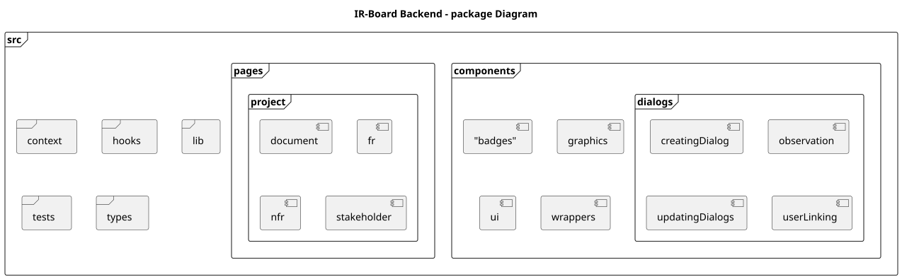
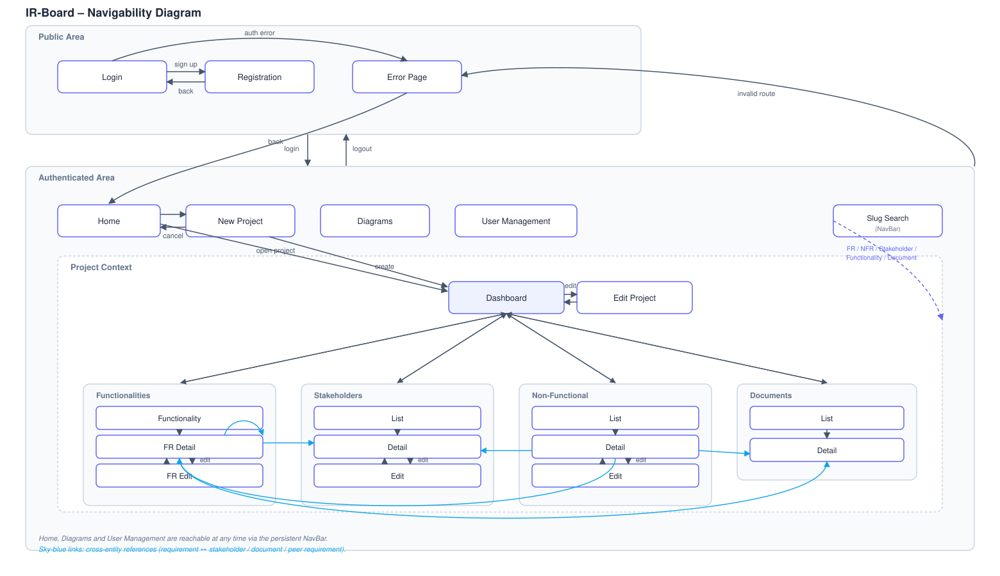

# Frontend

The frontend is a Single Page Application built with React and TypeScript, served as static content and communicating with the backend exclusively through the API gateway. The browser loads the application once; subsequent navigation is handled client-side by React Router, mapping URL paths to page components without full page reloads.

## Package organization



| Package | Contents |
|---|---|
| `pages` | One top-level component per route, responsible for data-fetching, permission checks, and layout for its view. |
| `components/badges` | State and role indicator chips used across entity detail views. |
| `components/dialogs` | Modal forms for entity creation, update, observation linking, and permission assignment. |
| `components/graphics` | Pie chart components used by project and functionality dashboards to visualize requirement state distribution. |
| `components/ui` | Unstyled primitives from the shadcn/ui component library. |
| `components/wrappers` | Route guards and context providers (`ProtectedRoute`, `ProjectLockWrapper`, `FunctionalitiesProviderWrapper`) that enforce authentication and project-scoped state before child routes render. |
| `contexts` | React contexts for the authenticated session and the currently active project/functionalities, avoiding prop drilling. |
| `hooks` | Custom hooks abstracting fetch lifecycle, loading/error states, and cache invalidation. |
| `lib` | Non-React utilities: configuration constants, graph helpers, the Kratos SDK client, and shared general-purpose helpers. |
| `types` | TypeScript interfaces mirroring backend DTOs, giving end-to-end type safety without duplicating the domain model. |
| `tests` | Mirrors the `src` structure, plus an `e2e` subfolder for Playwright scenarios. |

## The frontend permission model

Authorization is resolved on the backend through Ory Keto, but the frontend never queries Keto directly. Instead, permission information relevant to the UI is surfaced through specific DTO fields, treated as the source of truth for conditional rendering:

- **`isAdmin`** (boolean, on the user DTO) — drives visibility of system-wide administrative views and actions, such as user invitation and project creation.
- **`editPermission`** (boolean, on the project DTO) — set when the requesting user is linked as project manager for that project. Gates project-level mutating actions.
- **Functionality-level permission**, returned as a bucketed structure rather than a flat list:

```ts
export type Permission = "edit" | "view" | "none";
export type FunctionalitiesResponse = Record<Permission, Functionality[]>;
```

Rather than a single permission value per functionality, the backend buckets the full list by the permission level the current user holds: `edit` corresponds to requirement-engineer access or higher, `view` to stakeholder-level access, and `none` means the functionality exists but the user has no relationship to it. Components consuming this type read from the correct bucket rather than assuming a flat array.

As a rule, permissions are never inferred client-side from role names or other heuristics — components always defer to these fields, since they reflect the live ReBAC evaluation performed by the backend at request time.

## Partial DTOs

Several DTOs are intentionally partial depending on the calling context, mirroring the data the originating service call actually needs rather than always returning the full entity graph. The clearest example is the requirement DTO: list-oriented endpoints may omit the `children` collection entirely or return it empty, while detail-oriented endpoints populate it. Code consuming these types checks the specific endpoint's expected shape rather than assuming a field is always present just because the TypeScript type declares it.

## Navigability



The application is modeled as two top-level regions, split by the `ProtectedRoute` guard:

- A **Public Area** (Login, Registration, Error page), reachable without a session.
- An **Authenticated Area**, reachable only with a valid session, containing Home, New Project, Diagrams, and (behind an `adminOnly` guard) User Management as top-level views, plus a **Project Context** region scoped to a single project once one is selected or created.

Within the Project Context, the Project Dashboard is the central hub, from which a project manager reaches Edit Project or any of the project's entity collections (Functionalities, Stakeholders, Non-Functional Requirements, Documents). Each collection follows the same pattern: list → detail → edit, returning to detail once a change is saved or cancelled.

A dedicated slug-search shortcut (see [Requirements › Linking and Traceability](../user-guide/requirements/linking-and-traceability.md)) bypasses this hierarchy entirely, jumping straight to any entity's detail view given a valid identity slug.