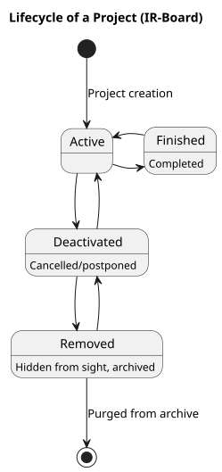
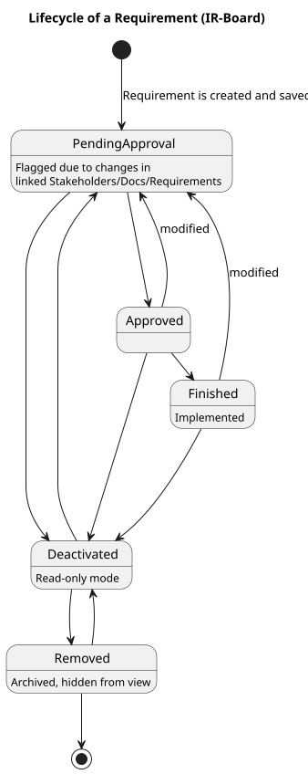
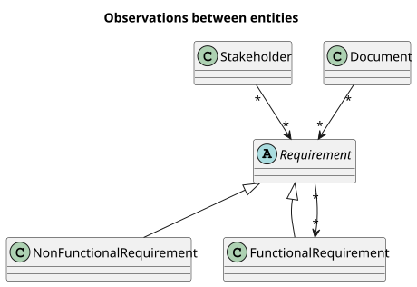

# Lifecycle and Workflows

Projects, functionalities, and requirements each carry their own state machine, enforced at the **domain layer** before any change reaches the database. This page covers how those state machines are implemented and, in particular, how changes propagate between linked entities.

## State machines

| Entity | States |
|---|---|
| `ProjectState` | `ACTIVE`, `FINISHED`, `DEACTIVATED`, `REMOVED` |
| `RequirementState` | `PENDING_APPROVAL`, `APPROVED`, `FINISHED`, `DEACTIVATED`, `REMOVED` (plus a separate `isPendingReview` flag layered on top) |

See [User Guide › Project Lifecycle](../user-guide/projects/project-lifecycle.md) and [User Guide › Requirement Lifecycle](../user-guide/requirements/requirement-lifecycle.md) for what each state means in practice, and how deactivation/removal cascade to nested requirements.

`PendingApproval` and `PendingReview` are intentionally implemented as lightweight flags rather than full states in their own right — `PendingReview` in particular is a boolean raised independently of whatever state the requirement is already in, which is what lets a requirement be, for example, both `Approved` and flagged for review simultaneously.

## The observer pattern behind "pending review"

A core cross-cutting process is how a change to one entity propagates a review flag to everything observing it. The relationship is directional: an **observed** entity (a stakeholder or document) can have many **observer** entities (requirements) watching it, and a modification to the observed entity triggers an `update()` call on every observer.

Concretely:

- Modifying or deactivating a **stakeholder** flags every requirement linked to it as pending review.
- Modifying, updating, or disabling a **document** flags every requirement linked to it as pending review.
- Modifying a **requirement** flags every **peer requirement** cross-linked to it (via horizontal traceability links, not parent/child nesting) as pending review.

This is implemented through the three explicit join tables described in [Database › Explicit Observer Join Tables](database.md#explicit-observer-join-tables) (`stakeholder_observer_requirement`, `document_observer_requirement`, `requirement_observing`), which allow indexed traversal from either side of each relationship — looking up "what observes this stakeholder" is just as cheap as "what does this requirement observe."

## Cascading state changes on removal and deactivation

Deactivation and removal of a parent requirement cascade to its nested children, but asymmetrically:

- **Deactivation** only affects descendants currently in `PENDING_APPROVAL`, `APPROVED`, or `REMOVED` — descendants already `FINISHED` are left alone.
- **Removal** is unconditional across the entire subtree, regardless of descendant state, and unlinks their observers in the process.

This asymmetry is a deliberate design choice: removal is meant to take a subtree with it entirely, since a removed parent has no meaningful use for children left dangling in an active state. One side effect worth knowing about: **reactivation does not cascade upward**. Reactivating a child leaves its parent's state untouched, which means a later removal of that still-deactivated parent will force-remove the just-reactivated child too. The system doesn't currently surface a warning before this happens — see [Concurrency](concurrency.md) for a related class of edge case around locking, and the project's open issue tracker for proposed hardening around this specific interaction.

## Where this logic lives

Following the [backend's layering](backend.md), all of this — state transition validity, cascade rules, and review-flag propagation — lives in the **domain entities themselves**, not in service classes. Application-layer services orchestrate the call (e.g. "approve this requirement"), but the rule of *what's allowed* is enforced by the domain model, independent of how the request arrived.