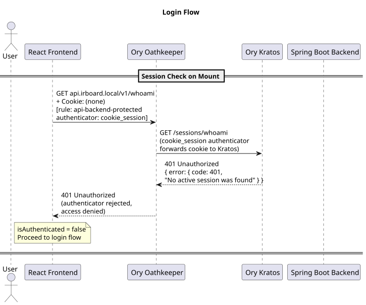
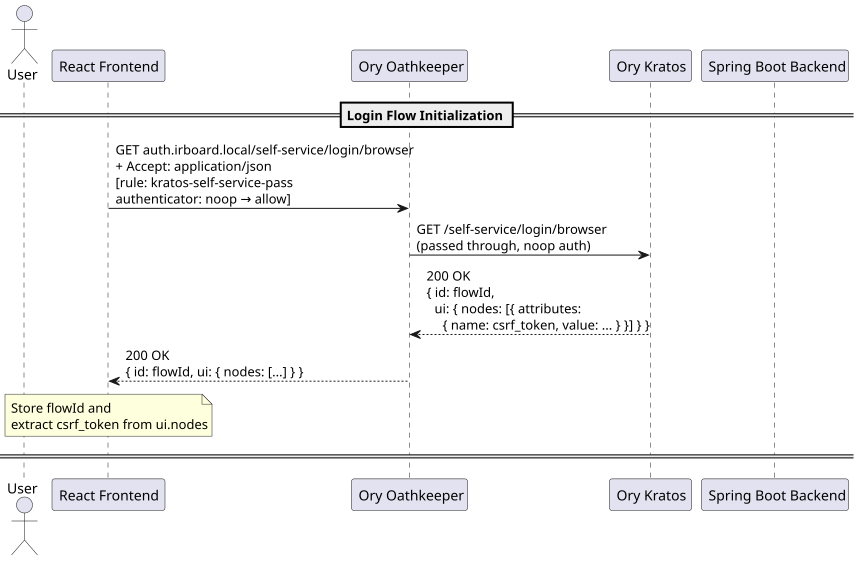
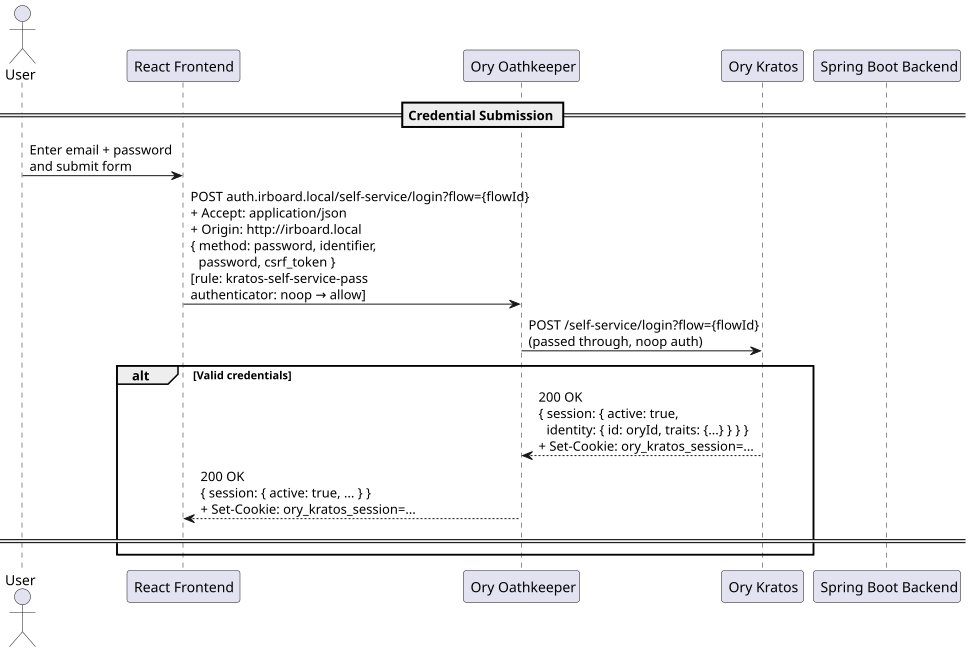
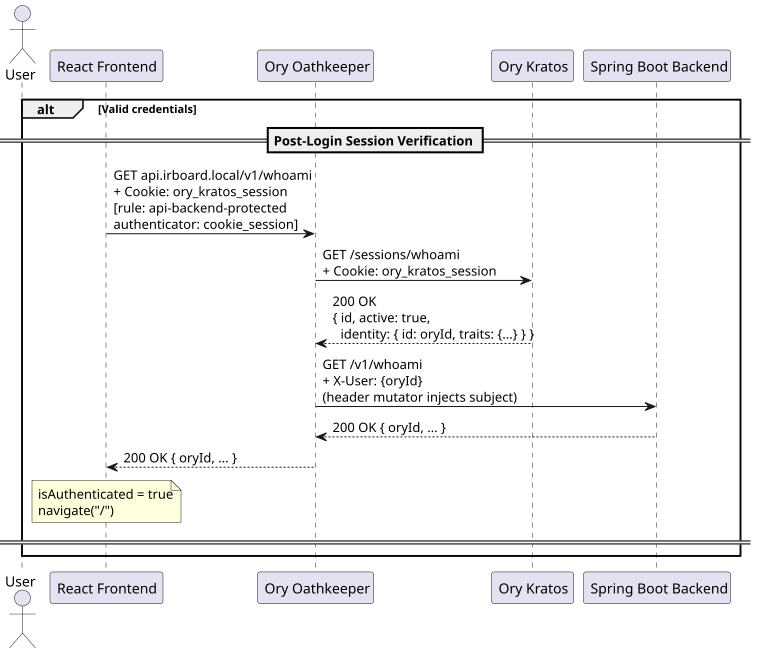
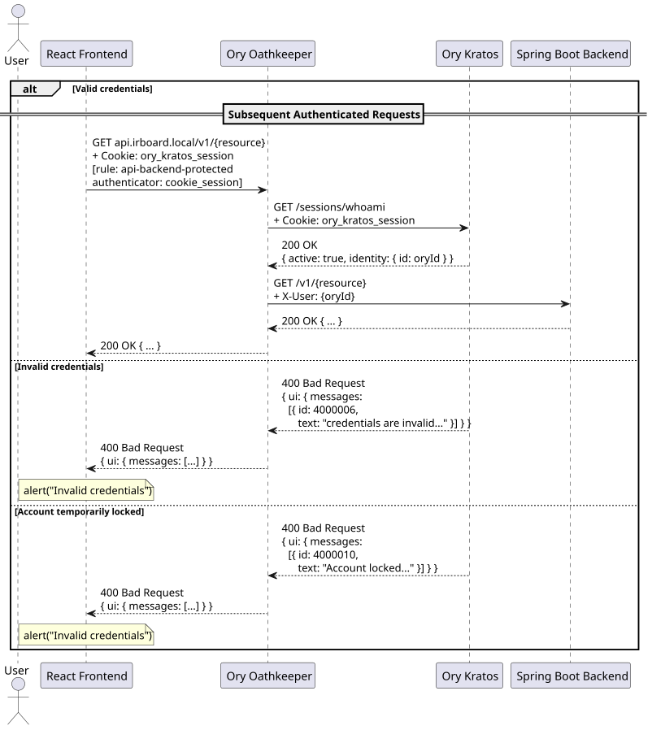
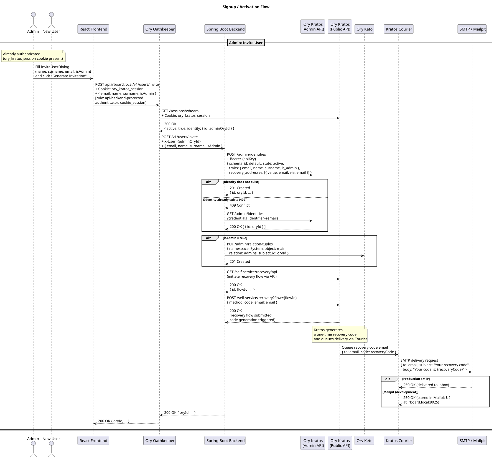
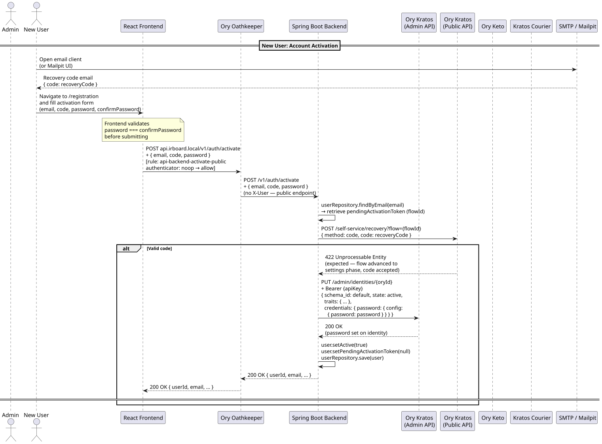
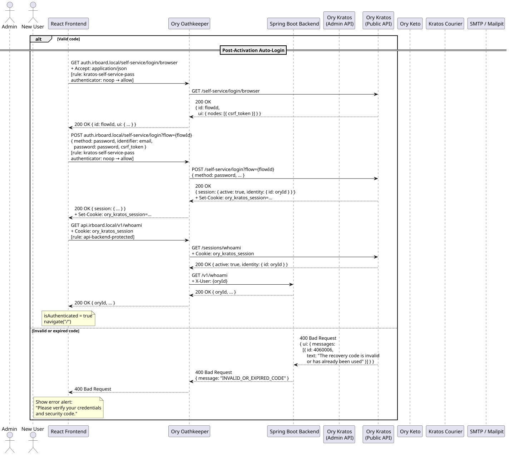

# Authentication Flows

This page walks through the two flows that establish or create an identity in IR-Board: signing in, and inviting/activating a new user.

## Login flow

1. The frontend checks for an existing session by calling the backend's `/v1/whoami` endpoint through Oathkeeper.
2. With no session cookie present, Oathkeeper's `cookie_session` authenticator calls Kratos's `/sessions/whoami` internally, receives a `401`, and rejects the request.
3. The frontend initializes a Kratos **browser login flow** through a passthrough rule that forwards the request to Kratos without requiring authentication.
4. Kratos returns a flow object containing a flow ID and a CSRF token.
5. The user submits their credentials, which are sent directly to Kratos through the same passthrough rule.
6. On success, Kratos returns a session object and sets the session cookie.
7. The frontend re-calls `/v1/whoami` through Oathkeeper — this time the cookie validates successfully, the resolved identity is injected as `X-User`, and the request reaches the backend.

From this point, every subsequent authenticated request follows the same validated path through Oathkeeper.

## Signup / invitation flow

New users don't self-register — an administrator invites them, and activation happens through a one-time code rather than an open signup form. This keeps account creation inside the system's access-control model rather than opening a public entry point into it.

1. An authenticated administrator fills in the invite dialog (name, surname, email).
2. The frontend sends the invitation request to the backend through Oathkeeper, which validates the admin's session before forwarding it.
3. The backend creates a new identity in Kratos via the Kratos **Admin API**, optionally grants system-level admin permissions in Keto, and initiates a Kratos **recovery flow** to generate a one-time code.
4. Kratos persists the delivery job; the **Kratos Courier** container polls for it and dispatches it to the configured SMTP relay. In a production deployment this relay delivers to the user's real inbox; in development or a self-hosted setup without one configured, **Mailpit** intercepts it instead.
5. The backend stores the recovery flow ID against the user record as a pending activation token.
6. The new user navigates to the registration page and submits their email, code, and chosen password. This goes through Oathkeeper's public activation rule, which requires no authentication (there's nothing to authenticate yet).
7. The backend validates the code against Kratos, then uses the Kratos Admin API to set the password directly on the identity. The user record is marked active.
8. The frontend automatically performs a standard login using the credentials just set, producing a valid session and navigating to the home page.

See [User Guide › Getting Started](../../user-guide/getting-started.md) for the same flow from the end user's perspective, and [User Guide › Access Control](../../user-guide/access-control.md) for who can send invitations.

## A practical consequence

Because Kratos expects a resolvable domain to be available at all times (rather than treating `localhost` as a special case), local development requires adding the configured domains to your hosts file. See [Deployment › Configuration](../../deployment/configuration.md) for the specifics.