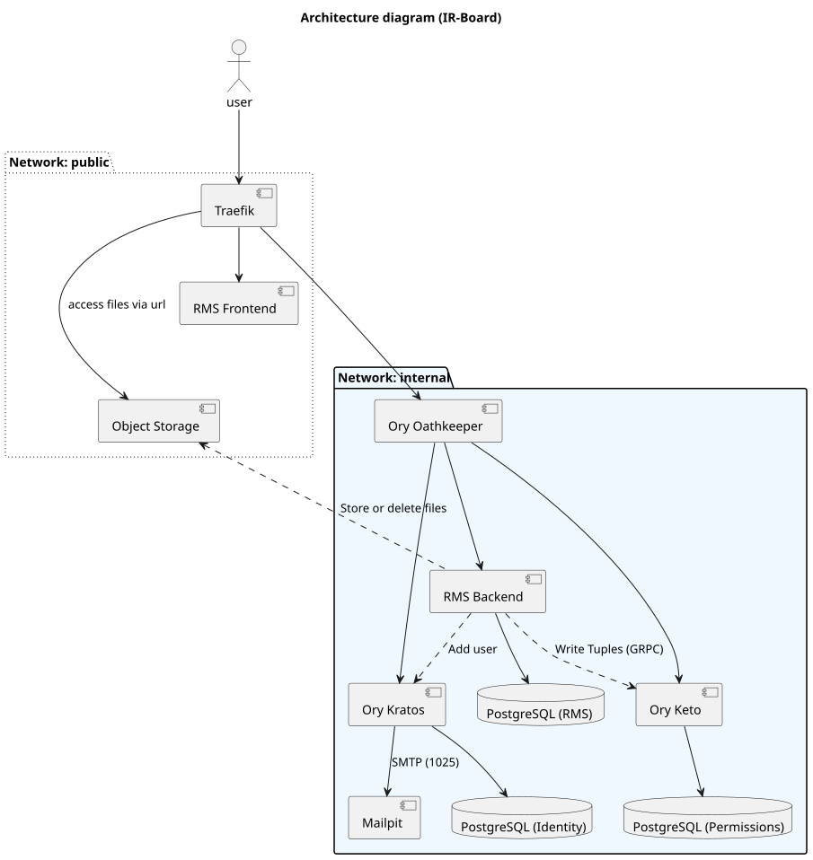
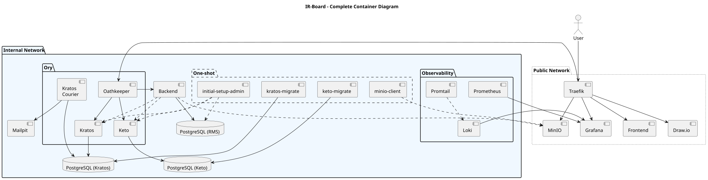

# System Overview

IR-Board is built as a set of containerized services behind a single public entry point, following a **Zero-Trust** model: no request is trusted by virtue of where it comes from, and every request crossing into internal services is validated on the way in.

## Containers

| Container | Role |
|---|---|
| **Traefik** | Entry point and TLS termination proxy. Routes requests dynamically and hides the internal network topology — nothing internal is exposed directly to the public internet. |
| **RMS Frontend** | The React/TypeScript single-page application, served as static content and executed entirely in the browser. |
| **Ory Oathkeeper** | Policy-enforcement gateway sitting between the public and internal networks. Validates session integrity (via Kratos) and fine-grained permissions (via Keto) before a request reaches an internal service. |
| **Ory Kratos** | Identity provider. Manages the full identity lifecycle: registration, session management, and credential handling. |
| **Ory Keto** | Relationship-based access control (ReBAC) server, inspired by Google's Zanzibar model. Stores permission tuples and answers authorization checks such as "is this user linked to this project?" |
| **RMS Backend** | The Spring Boot service containing the domain logic and data persistence. Writes and queries Keto for authorization decisions. |
| **Mailpit** | Local mail server used to capture and inspect emails sent by Kratos (invitations, recovery codes) during development and self-hosted deployments without a production SMTP relay. |

A secondary set of supporting containers is present but not part of the core request path:

| Container | Role |
|---|---|
| **draw.io** | Self-hosted diagramming tool, intended to be embedded in the frontend for creating flowcharts and similar diagrams directly within the platform. |
| **Grafana** | Observability dashboard, aggregating logs and metrics. |
| **Loki** | Log aggregation backend, queried by Grafana. |
| **Promtail** | Collects container logs from the Docker socket and forwards them to Loki. |
| **Prometheus** | Scrapes and stores operational metrics, exposed to Grafana. |

See [Technology Stack](technology-stack.md) for the languages and frameworks each of these is built with, and [Observability](observability.md) for how the logging/metrics containers are used in practice.

*Main request flow shown as solid arrows; secondary inter-service messaging as dotted arrows.*

??? note "Full architecture diagram, including supporting containers"
    

## Request flow

A typical authenticated request follows this path:

1. The browser sends a request to **Traefik**, which terminates TLS and routes it based on hostname/path.
2. **Oathkeeper** intercepts the request. For protected routes, it validates the session cookie against **Kratos** and checks the required permission against **Keto**.
3. If both checks pass, Oathkeeper forwards the request to the **backend**, injecting the resolved identity as a header (`X-User`) so the backend doesn't need to talk to Kratos directly.
4. The backend processes the request against its domain logic and the database, writing or reading Keto relationship tuples as needed for authorization-sensitive operations.

See [Security › Zero-Trust Perimeter](security/zero-trust-perimeter.md) for more detail on this flow, and [Security › Authentication Flows](security/authentication-flows.md) for the login and signup sequences specifically.

## Why microservices here

Splitting identity, authorization, and gateway concerns into dedicated services — rather than building them into the backend — means each of those concerns is handled by a component built specifically for it, and none of that security-critical code has to be maintained as part of the application's own codebase. The trade-off is added infrastructure complexity: more moving parts, more configuration surface, and a genuine learning curve if you're new to the Ory ecosystem. See [Security](security/index.md) for the authorization model this unlocks.