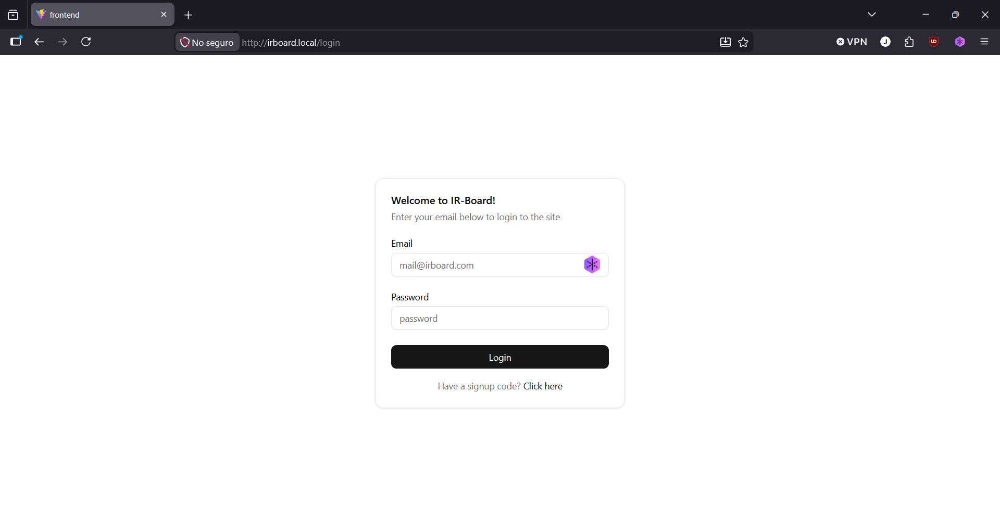
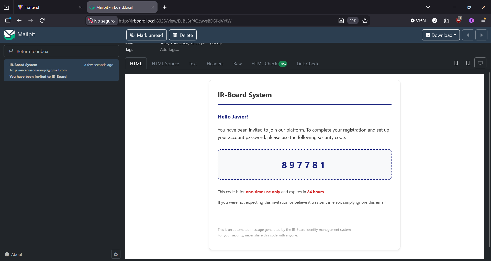
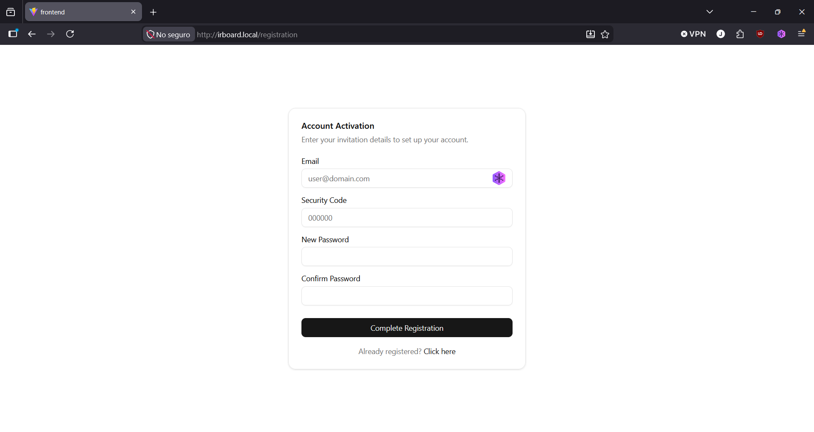
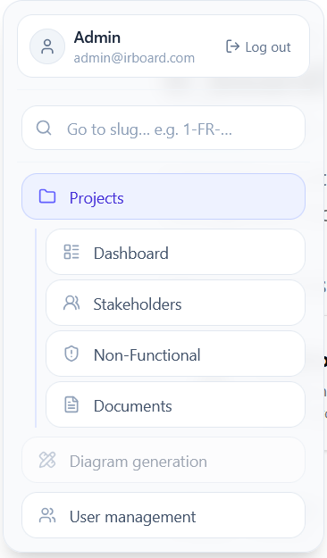
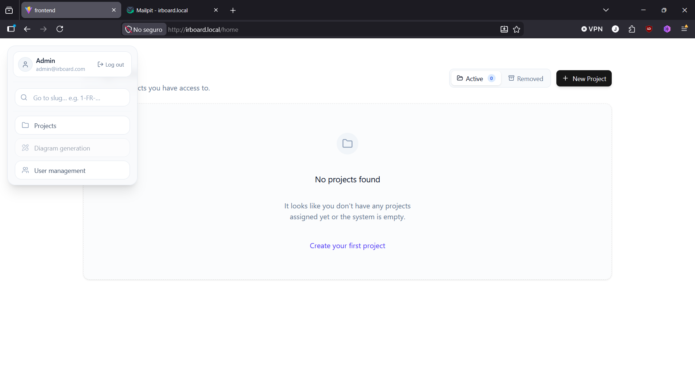

# Getting Started

## Signing in

Open the platform's URL in a browser. If you don't have an active session, you'll land on the **Login** page.

Enter your email and password and select **Login**.

If this is your first time accessing the system, you won't have a password yet — an administrator will have invited you, and you'll have received an email containing a one-time signup code.

Enter that code on the **Registration** page (reachable via the *Click here* link at the bottom of the login page), along with a permanent password between 15 and 64 characters long.

Once your password is set, you'll be signed in automatically and taken to the home page.

!!! note
    Invitation emails are sent through whatever mail relay the deployment is configured with. In development or self-hosted setups without a production mail server, check with your administrator about where invitation emails are being captured (see [Deployment › Services](../deployment/services.md)).

## Navigating the application

Once signed in, a collapsible navigation bar sits fixed to the top-left corner of the screen. Hover over it to expand it.

From the expanded navigation bar you can:

- Log out
- Search for any entity by its **identity slug** (see [Requirements › Linking and Traceability](requirements/linking-and-traceability.md))
- Reach the main top-level areas: **Home**, **New Project**, **Diagrams**, and — if you're a system administrator — **User Management**

While you're inside a project, an additional, indented section appears beneath the top-level links, giving direct access to that project's **Dashboard**, **Stakeholders**, **Non-Functional Requirements**, and **Documents** views.

## The home page

The home page lists every project you're linked to. If you haven't been linked to any project yet, it's shown empty.

If you have permission to create projects (see [Access Control](access-control.md)), a **New Project** button is available. See [Projects › Creating a Project](projects/creating-a-project.md) for the full walkthrough.

## Where to go next

- New to a project? Start with [Projects](projects/index.md).
- Ready to document what the system needs to do? Go to [Requirements](requirements/index.md).
- Need to track who has a stake in the project? See [Stakeholders](stakeholders.md).
- Have supporting files to attach? See [Documents](documents.md).