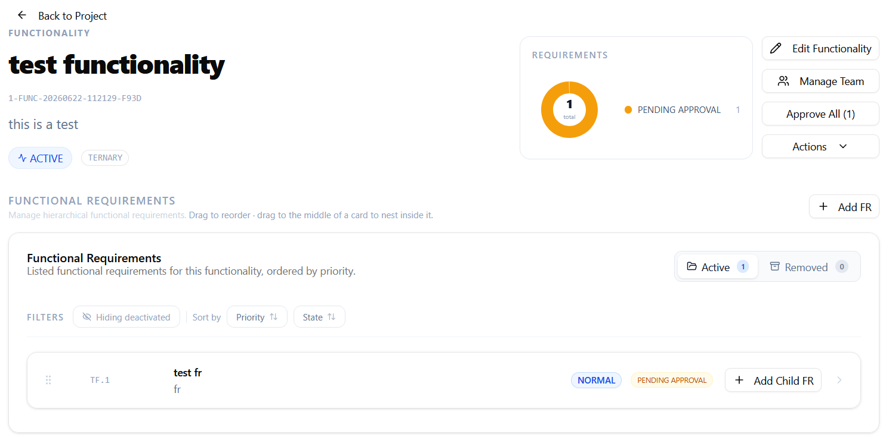

# Functionalities

A **functionality** represents a system capability or feature grouping within a project. Functional requirements are organized under functionalities, and access for requirement engineers and stakeholder users is scoped to individual functionalities rather than to the whole project — see [Access Control](../access-control.md).

## Adding a functionality

Project managers can add a functionality to an active project:

1. Open the **Add functionality** dialog from the project view.
2. Enter a **name**.
3. IR-Board automatically generates a short **label** from the initial letters of each word in the name (for example, "User Management" becomes `UM`). This label prefixes the dynamic identifiers of every requirement created under the functionality.
4. Optionally, override the generated label with a custom one.
5. Confirm.

The label must be unique within the project — if it collides with an existing one, you'll be asked to adjust it before the functionality is created. You're automatically linked to the new functionality as its manager.

## Working within a functionality

Once created, a functionality can be modified (its name or label updated) by a project manager at any time while active.

From the functionality's view, you can:

- See the list of functional requirements it contains, with options to collapse/expand nested requirements.
- Create new functional requirements — see [Requirements › Functional Requirements](../requirements/functional-requirements.md).
- Approve all pending requirements within the functionality in a single action.

## Deactivating and reactivating

A project manager can deactivate a functionality, which asks for confirmation and then puts the functionality — and every element it contains — into read-only mode. Reactivating it restores normal access.

Deactivating a functionality does **not** delete anything inside it; requirements, their states, and their links are preserved and become editable again once the functionality is reactivated.