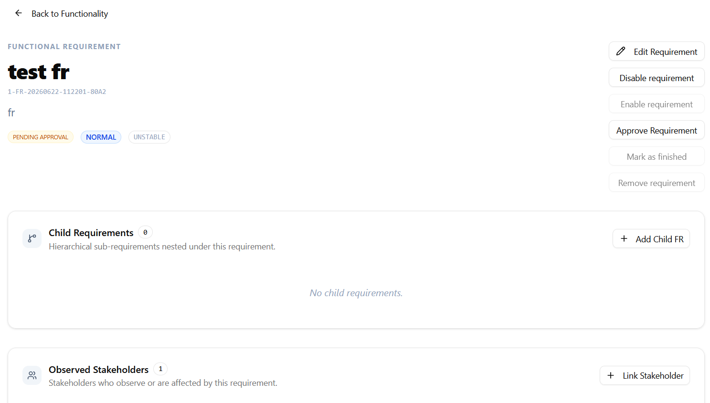
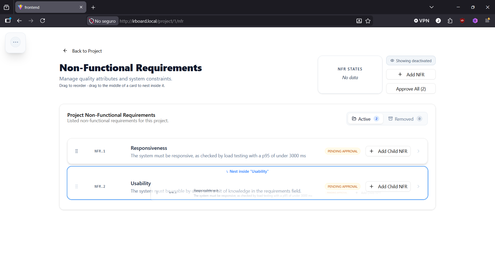
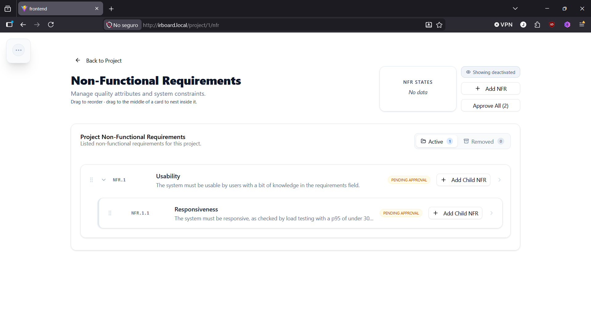

# Functional Requirements

A functional requirement describes a behavior or service the system must provide. It always belongs to a specific [functionality](../projects/functionalities.md), and only users linked to that functionality can access or modify it.

## Creating a functional requirement

Project managers and requirement engineers linked to the relevant functionality can create one:

1. Navigate to a functionality you're linked to and select **Add requirement**.
2. Enter a **name** and **description** — both required.
3. Select a **priority**, following the priority style configured when the project was created (Ternary or MOSCOW — see [Creating a Project](../projects/creating-a-project.md)).
4. Optionally, set a **stability** value, indicating how settled the requirement is expected to be.
5. Optionally, set a **stakeholder** as the requirement's origin.
6. Confirm.

The new requirement is created in the **Pending Approval** state (see [Requirement Lifecycle](requirement-lifecycle.md)), with two identifiers generated automatically:

- A **dynamic identifier**, built from the functionality's label and the requirement's position (e.g. `FR-UM-001`), kept up to date automatically as requirements are reordered or nested.
- An **internal unique slug**, which stays stable for the requirement's entire lifetime and is used for direct lookup — see [Linking and Traceability](linking-and-traceability.md).

## Nesting requirements

A functional requirement can be created as a **child** of an existing one, for hierarchical decomposition. Nested requirements get a dynamic identifier that reflects their position (e.g. `FR-UM-001.1` under `FR-UM-001`).

To nest an existing requirement, press and hold the handle on the left of a requirement in the list view and drag it onto or around another requirement.

The requirement then displays as a child of its new parent and can be collapsed or expanded from the list.

## Reordering requirements

Users linked to a functionality can reorder its requirements by dragging them within the list. IR-Board uses a floating-point order value internally, so reordering doesn't require renumbering every other requirement in the list — only the dynamic identifiers of affected requirements are recalculated.

## Modifying a functional requirement

A project manager or requirement engineer linked to the functionality can modify a requirement at any time while it isn't deactivated or removed. Saving a change with modified content flags any linked requirements, stakeholders, or documents as **pending review** — see [Requirement Lifecycle](requirement-lifecycle.md) for what that means in practice.