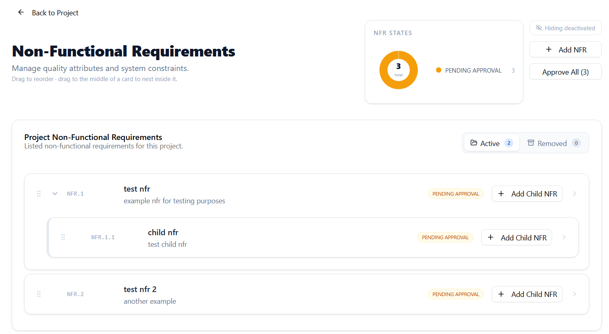
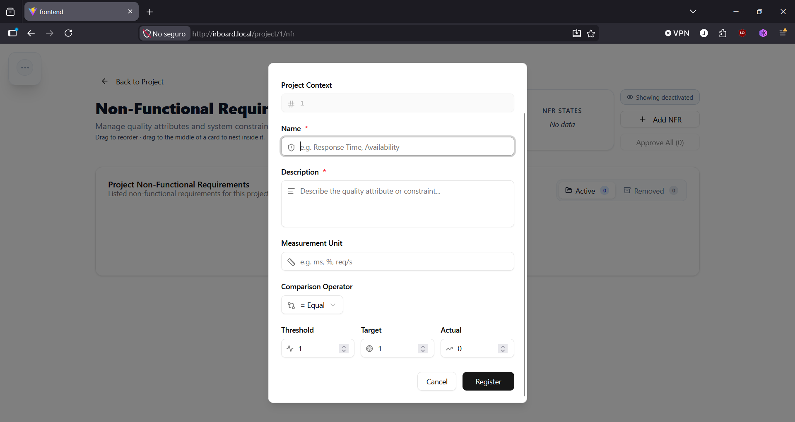
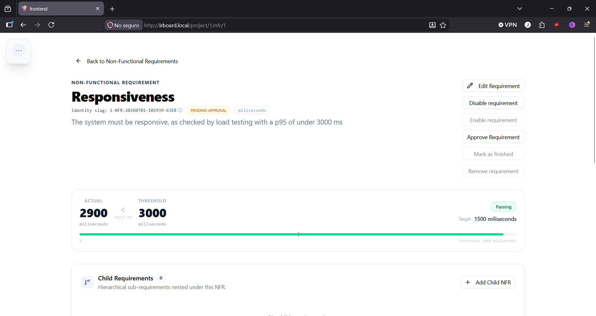

# Non-Functional Requirements

A non-functional requirement describes a measurable quality constraint — performance, reliability, security, or similar — rather than a specific behavior. Unlike functional requirements, non-functional requirements belong to the **project** directly rather than to a specific functionality, since quality attributes typically apply across the whole system.

## Creating a non-functional requirement

Project managers and requirement engineers linked to the project can create one from the project's **Non-Functional Requirements** view:

1. Select **Add requirement**.
2. Enter a **name** and **description** — both required.
3. Optionally, set:
    - A **measurement unit** (e.g. milliseconds, requests per second).
    - A **comparison operator**: equal to, less than, or greater than.
    - A **threshold value** — the minimum value needed for the requirement to be considered passed.
    - A **target value** — the optimal value the team is aiming for.
    - An **actual value** — the current measured state.
4. Confirm.

All of the numeric fields are optional at creation time, but filling them in unlocks automatic pass/fail evaluation: if a threshold, operator, and actual value are all present, the requirement's detail view shows whether it is currently **passing**, by comparing the actual value against the threshold using the selected operator.

## Updating measurements over time

As a non-functional requirement's actual value changes — after a load test, a performance fix, or a new measurement — update the **actual value** field on the requirement to reflect current reality. This doesn't change the requirement's state on its own, but keeps the pass/fail indicator accurate.

## Shared behavior with functional requirements

Non-functional requirements share the same lifecycle, identifier scheme, and linking mechanisms as functional requirements — see [Requirement Lifecycle](requirement-lifecycle.md) and [Linking and Traceability](linking-and-traceability.md). The main difference is scope (project-level rather than functionality-level) and the additional measurement fields described above.