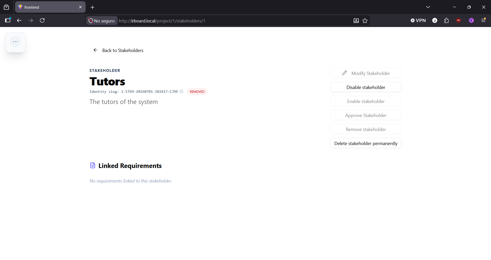

# Requirement Lifecycle

Every requirement — functional or non-functional — moves through the same set of states.

| State | Meaning |
|---|---|
| **Pending Approval** | Not yet validated by a stakeholder. This is the state every new requirement starts in. |
| **Pending Review** | Flagged automatically because something it's linked to has changed. This is a flag layered on top of the other states rather than a fully separate state — a requirement can be, for example, both Approved and Pending Review at once. |
| **Approved** | Validated by the appropriate stakeholders. |
| **Finished** | The requirement's functionality has been accomplished, until further modification or deactivation. |
| **Deactivated** | Cancelled or paused. Deactivated requirements don't count toward project metrics. |
| **Removed** | Hidden from view and archived. |

## Approving requirements

A project manager can mark one or more requirements as **Approved**, provided they're currently **Pending Approval** and not flagged as **Pending Review**. If a requirement is pending review, it needs attention and re-saving before it can be approved.

Approval can be done individually, or in bulk at the functionality or project level — useful once several requirements are ready at once.

## Marking a requirement as finished

A project manager can mark an approved requirement as **Finished**. If the requirement is modified afterward, it automatically reverts to **Pending Approval**, since a change means it needs to be validated again.

## Deactivating and removing

To change a requirement's state, use the corresponding button on its detail view — the same pattern used across every entity's detail view:

A requirement engineer or project manager linked to the functionality can:

- **Deactivate** a requirement that's pending approval, putting it in read-only mode and flagging any linked requirements as pending review.
- **Reactivate** a deactivated requirement, which automatically flags it as pending review (since it may have been out of date while inactive).
- **Remove** a deactivated requirement, archiving it and hiding it from view.
- Permanently **delete** a removed requirement — a project manager-only action.

### How removal and deactivation cascade to children

These two actions behave differently with respect to a requirement's nested children:

- **Deactivating** a parent only deactivates descendants currently in Pending Approval, Approved, or Removed state — descendants already marked **Finished** are left untouched.
- **Removing** a parent removes **every** descendant unconditionally, regardless of their current state, and unlinks their observers in the process.

This asymmetry is intentional: removal is meant to take an entire subtree down with it, since a removed parent has no real use for children left dangling in an active state. One consequence worth knowing: reactivating a child doesn't change its parent's state. If you reactivate a child while its parent is still deactivated, and someone later removes that parent, the child is removed along with it — even though it had just been independently reactivated. IR-Board doesn't currently warn about this scenario before a removal is confirmed, so it's worth checking a parent's children before removing it if some of them are active.

## Pending review, in practice

Modifying or deactivating a stakeholder or document flags every requirement linked to it as **Pending Review**, regardless of the requirement's current state. This is the mechanism that keeps traceability meaningful: an approved requirement whose supporting document just changed won't silently stay "approved" against outdated material — it gets flagged so a human re-checks it.